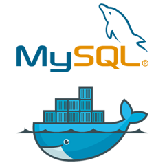

<p align="center">
<br>Departamento de Computação (DComp-So)</br>
<br>Centro de Ciências e Gestão em Tecnologias (CCGT)</br>
<br>UNIVERSIDADE FEDERAL DE SÃO CARLOS - Campus Sorocaba</br><br></br>

</p>

# NewSQL - Disponibilidade
<sub>Autores: Adriano Tomicha & Ailton Morais</sub>

<a id="indice"></a>
# Índice
* [Introdução](#introducao)    
	* [MySQL Cluster](#sobre-mysqlcluster)
	* [CockroachDB](#sobre-cockroachdb)
    * [Estudo de Caso](#caso)	
* [Visão Geral](#geral)
	* [Alta Disponibilidade](#disponibilidade)
    	* [MySQL Cluster](#disponibilidade-mysqlcluster)
    	* [CockroachDB](#disponibilidade-cockroachdb)
* [Resiliência a Falhas](#resiliencia)	
    * [MySQL Cluster](#resiliencia-mysqlcluster)
    * [CockroachDB](#resiliencia-cockroachdb)
* [Instalação e Configuração](#instalacao)
	* [Docker](#instalacao-docker)
	* [MySQL Cluster](#instalacao-mysqlcluster)
	* [CockroachDB](#instalacao-cockroachdb)
* [Disponibilidade na Prática](#pratica)
	* [MySQL Cluster](#pratica-mysqlcluster)
	* [CockroachDB](#pratica-cockroachdb)
* [Conclusão](#conclusao)
	* [Resumo](#resumo)
* [Glossário](#glossario)
* [Referências Bibliográficas](#referencias)

<a id="introducao"></a>
## Introdução

A proposta do tutorial é apresentar o passo a passo desde a instalação, configuração, casos de uso e testes que irão ajudar a entender a abordagem da **disponibilidade** do [MySQL Cluster](https://www.mysql.com/products/cluster/) & [CockroachDB](https://www.cockroachlabs.com/product/)

<a id="sobre-mysqlcluster"></a>
### MySQL Cluster

MySQL Cluster é o banco de dados distribuído que combina escalabilidade linear e alta disponibilidade. Foi projetado para aplicativos de missão crítica, fornece acesso em tempo real na memória com consistência transacional em conjuntos de dados particionados e distribuídos [(MySQL 2020a)](#MySQL-2020a).

O Cluster MySQL tem replicação entre clusters em vários locais geográficos integrados e uma arquitetura nada compartilhada com reconhecimento de localidade de dados torna a escolha perfeita para execução em hardware comum e em infraestrutura em nuvem distribuída globalmente [(MySQL 2020a)](#MySQL-2020a).

<a id="sobre-cockroachdb"></a>
### CockroachDB

CockroachDB é um banco de dados SQL distribuído construído em um armazenamento de chave-valor transacional e fortemente consistente. Ele é dimensionado horizontalmente, sobrevive a falhas de disco, máquina, rack e até mesmo de datacenter com interrupção de latência mínima e sem intervenção manual, suporta transações ACID fortemente consistentes e fornece uma API SQL familiar para estruturar, manipular e consultar dados [(Cockroach Labs 2020a)](#Cockroach-2020a).

<a id="caso"></a>
### Estudo de Caso

Neste tutorial será utilizado o Banco de Dados do Northwind que foi criado pela Microsoft para atender os seus produtos, mas ao longo do tempo se tornou uma amostra bastante utilizada em tutoriais de Banco de Dados não desenvolvidos pela Microsoft. Dentre as amostras do Banco de Dados Northwind podemos destacar:

* Suppliers
  
* Customers
  
* Employees
  
* Products
  
* Shippers
  
* Orders

No total o Banco de Dados Northwind contém 14 tabelas. O diagrama com o relacionamento entre as tabelas pode ser visto abaixo:

<p align="center">

<br>Figura 1: Diagram ER. Fonte: (YugabyteDB 2020a)</br>
</p>

<a id="geral"></a>
## Visão Geral

Os Bancos de Dados relacionais surguiram para necessidade de armazenamento de dados, mas na época não existia as tecnologias Web e os diversos tipos de dispositivos que geram uma enorme quantidade de dados se compararmos com a nossa realidade atual.

Com a evolução tecnológica e o astronômico crescimento dos dispositivos móveis conectados a internet abriu caminho para a era da Internet das Coisas e já estamos vivendo mudanças significativas na sociedade. Veja algumas declarações que demonstram tal potencial:

* A  Internet das Coisas será uma revolução muito maior que a internet e os celulares juntos! [(Krco, Srdjan, et al, 2013)](#Krco-2013);
  
* A Internet das Coisas representa uma nova inteligência para os negócios, É uma mudança de paradigma do consumo, uma revolução do comportamento humano, um caminho para um novo mundo onde tudo e todos estarão conectados e sem fronteiras. Um caminho para um mundo que ainda não imaginamos [(Dias, 2016)](#Dias-2016).

A partir destes desafios surgiram os novos sistemas de Banco de Dados nomeados como **NoSQL** (Not Only SQL). Estas soluções fornecem alta disponbilidade, escalabilidade e uma arquitetura distribuída com crescimento horizontal. Mesmo sendo capaz de manipular grandes quantidades de dados, os Banco de Dados NoSQL geralmente não possuem suporte para as propriedades ACID:

* **A**tomicity: Transação deve ser executado por completo ou não executada;

* **C**onsistency: Se o resultado final não for válido ou ocorrer falha, os dados devem ser o mesmo antes do inicio da transação;

* **I**solation: Um transação em andamente não deve sofrer interferência de outra transação concorrente;

* **D**urability: Garante os dados disponíveis em definitivo.

Para quebrar alguns paradgimas foi criado os sistemas de Banco de Dados **NewSQL** que combinam funcionalidades do modelo relacional e NoSQL. Segundo [Pavlo e Aslett, 2016](#Pavlo-2016) os sistemas **NewSQL** são soluções modernas que buscam prover o mesmo desempenho escalável dos Bancos de Dados **NoSQL** para cargas de trabalho **OLTP** com tı́pico suporte completo a todas as propriedades **ACID**, como encontrado nos Banco de Dados Relacionais.

Os sistemas de Banco de Dados NewSQL são adequados para aplicações que utilizavam o **SGBD** tradicional, mas que surgiu a necessidade de escalabilidade adicional e aprimoramento de desempenho [(YUAN, et al, 2015)](#Yuan-2015).

Os sistemas de Banco de Dados NewSQL tem como característica a execução de transações de leitura e gravação que:

* São de curta duração;

* Atingue um pequeno subconjunto de dados;
  
* Não fazem varredura de tabela completa;

* Possuem consultas repetidas com diferentes entradas.

De acordo com [Pavlo e Aslett, 2016](#Pavlo-2016) pode existir uma caracterização mais restrita com a implementação de um sistema de Banco de Dados NewSQL que utiliza:

* Um esquema de controle de simultaneidade sem bloqueio;

* Uma arquitetura distribuída não compartilhada.

[STONEBRAKER e CATTEL, 2011](#STONEBRAKER-CATTEL-2011) definem as cinco principais características de um SGBD NewSQL abaixo:

1. SQL como o principal mecanismo de interação de aplicativos;

2. Suporte ACID para transações;
  
3. Um mecanismo de controle de simultaneidade não bloqueável, portanto as leituras em tempo real não entrarão em conflito com as escritas;

4. Uma arquitetura que oferece um desempenho por nó muito maior que o disponível nas soluções SGBDs tradicionais;

5. Uma arquitetura de escala, não compartilhada, capaz de funcionar em um grande número de nós sem sofrerem estrangulamentos.

Segundo [Pavlo e Aslett, 2016](#Pavlo-2016) as três categorias que melhor representam os sistemas de Banco de Dados NewSQL são:

1. Sistemas inovadores construídos a partir do zero usando uma nova arquitetura;

2. Middleware que re-implementam a mesma infra-estrutura que foi desenvolvida na década de 2000 pelo Google e outros;
   
3. Ofertas de banco de dados como serviço de provedores de computação em nuvem que também são baseadas em novas arquiteturas.

Certamente podemos considerar que os sistemas de Banco de Dados NewSQL conseguem resolver os principais problemas de escalabilidade, desempenho e disponibilidade que temos no sistema relacional tradicional. Segundo [KAUR, 2017](#Kaur-2017) o NewSQL deve ser considerado como uma alternativa ao NoSQL ou banco de dados relacional clássico para novos aplicativos OLTP.

<a id="disponibilidade"></a>
## Alta Disponibilidade

A alta disponibilidade não está relacionada somente ao tempo que um sistema está acessível, mas também ao tempo que o sistema precisa para responder às solicitações dos usuários. Geralmente além dos testes é necessário prover componentes redundantes para obter um nível de disponibilidade alta mesmo em caso de falhas em parte da infra-estrutura.

<a id="disponibilidade-mysqlcluster"></a>
### MySQL Cluster

Para garantir a alta disponibilidade o MySQL Cluster se apoia em [(MySQL 2020b)](#MySQL-2020b):

* **Replicação síncrona**: Os dados em cada nó de dados são replicados de forma síncrona para outro nó de dados;

* **Failover automático**: - O mecanismo de pulsação do MySQL Cluster detecta instantaneamente quaisquer falhas e faz failover automaticamente, normalmente em um segundo, para outros nós no cluster, sem interromper o serviço aos clientes;

* **Autocorreção**: Os nós com falha são capazes de se autocorrigir reiniciando automaticamente e ressincronizando com outros nós antes de reingressar no cluster, com total transparência do aplicativo;

* **Arquitetura de nada compartilhado**: Nenhum ponto único de falha, cada nó tem seu próprio disco e memória, portanto, o risco de uma falha causada por componentes compartilhados, como armazenamento, é eliminado;

* **Replicação geográfica**: A replicação geográfica permite que os nós sejam espelhados em data centers remotos para recuperação de desastres.

<a id="disponibilidade-cockroachdb"></a>
### CockroachDB

Para o CockroachDB escalar os serviços horizontalmente é fundamental, para tal devemos utilizar a replicação dos dados em diversos servidores. Em caso de falha de um desses servidores, podemos continuar com os serviços operacionais. Segue um resumo com os principais conceitos utilizados para garantir a disponibilidade [(Cockroach Labs 2020b)](#Cockroach-2020b):

* **Consistência**: Usa a "consistência" tanto no sentido da semântica ACID (Atomicity, Consistency, Isolation, Durability) quanto no teorema CAP (Consistency, Availability, Partition Tolerance), embora menos formalmente do que qualquer definição. O objetivo é garantir os dados livres de anomalias;

* **Intervalo**: Armazena todos os dados do usuário (tabelas, índices, etc.) e quase todos os dados do sistema em um mapa gigante classificado de pares de chave-valor. Este keyspace é dividido em "intervalos", pedaços contíguos do keyspace, de forma que cada chave pode sempre ser encontrada em um único intervalo;

* **Consenso**: Quando um Intervalo recebe uma gravação, um quorum de nós contendo réplicas do intervalo confirma a gravação. Isso significa que seus dados são armazenados com segurança e a maioria dos nós concorda com o estado atual do banco de dados, mesmo se alguns dos nós estiverem offline. Quando uma gravação não chega a um consenso, o progresso de encaminhamento é interrompido para manter a consistência dentro do cluster;

* **Replicação**: Criação e distribuição de cópias de dados, bem como a garantia de que as cópias permaneçam consistentes. No entanto, existem vários tipos de replicação: a saber, síncrona e assíncrona. O CockroachDB usa a replicação síncrona que requer que todas as gravações se propaguem para um quorum de cópias dos dados antes de serem consideradas confirmadas;

* **Transações**: Conjunto de operações realizadas em seu banco de dados que atendem aos requisitos da semântica ACID. Este é um componente crucial para um sistema consistente confie no seu banco de dados;

* **Disponibilidade Multi-ativa**: O consenso de alta disponibilidade permite que cada nó no cluster controle leituras e gravações para um subconjunto dos dados armazenados (em uma base por intervalo).

<a id="resiliencia"></a>
## Resiliência a Falhas

A confiabiliade de um sistema gerenciador de Banco de Dados tem um relação direta com a resiliência a falhas e redundância dos dados. Segundo [Silberschatz, 2006](#Silberschatz-2006) a solução para o problema de confiabilidade é introduzir a redundância; ou seja, armazenamos informações extras que normalmente não são necessárias, mas que podem ser usadas no caso de falha de um disco, para recriar a informação perdida. Assim, mesmo que um disco falhe os dados não são perdidos [...]

<a id="resiliencia-mysqlcluster"></a>
### MySQL Cluster

No mínimo de três computadores para executar um cluster viável. No entanto, o número mínimo recomendado de computadores em um Mysql Cluster NDB é quatro: um para cada para executar o gerenciamento e os nós SQL, e dois computadores para servir como nós de dados. O objetivo dos dois nós de dados é fornecer redundância; o nó de gerenciamento deve ser executado em uma máquina separada para garantir serviços de arbitragem contínuos no caso de um dos nós de dados falhar [(MySQL 2020c)](#MySQL-2020c).

<p align="center">

<br>Figura 2: Sem um único ponto de falha, o MySQL Cluster oferece extrema resiliência a falhas. Fonte: (MySQL 2020b)</br>
</p>

<a id="resiliencia-cockroachdb"></a>
### CockroachDB

Quando você estiver pronto para executar o seu sistema em produção em uma única região, é importante implantar pelo menos 3 nós do CockroachDB para aproveitar as vantagens dos recursos de replicação, distribuição, rebalanceamento e resiliência automáticos [(Cockroach 2020c)](#Cockroach-2020c).

<p align="center">

<br>Figura 3: Topologia Básica. Fonte: (Cockroach 2020c)</br>
</p>

<a id="instalacao"></a>
## Instalação e Configuração

A distribuição [Ubuntu](https://ubuntu.com/) 18.04 do Linux será o sitema operacional utilizado em todo o processo de instalação e experimentos deste tutorial. Em meados de 2004 foi lançado a primeira versão do Ubuntu que cresceu e se tornou a mais popular distribuição Linux Desktop conhecida por ser considerado um sistema operacional fácil de ser usado. Todos os comandos mostrados ao longo deste tutorial podem ser reproduzidos em qualquer distribuição derivada do [Debian](https://www.debian.org/). É importante lembrar que os Banco de Dados **MySQL Cluster** e **CockroachDB** serão instalados no **Docker**.   

<a id="instalacao-docker"></a>
### Docker

O [Docker](https://www.docker.com/) é uma plataforma de código aberto desenvolvida na linguagem [go](https://golang.org/). O **Docker** permite criar, testar e implementar aplicações em um ambiente apartado da máquina original conhecido como contâiner. Isso possibilita que qualquer software seja empacotado de maneira padronizada.

<p align="center">

<br>Figura 4: Docker logo. Fonte: (Docker 2020a)</br>
</p>

Siga as instruções abaixo para instalação [(Digitalocean 2020a)](#Digitalocean-2020a).

1. Execute o comando de atualização para garantir as listas de fontes mais recentes:

```bash
$ sudo apt update
```

2. Instale os pacotes de pré-requisitos para garantir que o **apt** utilize pacotes via HTTPS:

```bash
$ sudo apt install apt-transport-https ca-certificates curl software-properties-common
```

3. Adicione a chave GPG para o repositório oficial do Docker em seu sistema:

```bash
$ curl -fsSL https://download.docker.com/linux/ubuntu/gpg | sudo apt-key add -
```

4. Adicione o repositório do Docker as fontes do APT:

```bash
$ sudo add-apt-repository "deb [arch=amd64] https://download.docker.com/linux/ubuntu bionic stable"
```

5. Execute o comando de atualização para garantir as listas de fontes mais recentes:

```bash
$ sudo apt update
```

6. Instale o Docker:

```bash
$ sudo apt install docker-ce
```

7. Neste o ponto o Docker deve ser instalado, o deamon iniciado e o processo ativado. Verifique executando o comando abaixo:

```bash
$ sudo systemctl status docker
```

8. Confirme se o comando executado acima mostra o serviço como ativo, conforme exibido abaixo:

```bash
Output
● docker.service - Docker Application Container Engine
   Loaded: loaded (/lib/systemd/system/docker.service; enabled; vendor preset: enabled)
   Active: active (running) since Thu 2018-07-05 15:08:39 UTC; 2min 55s ago
     Docs: https://docs.docker.com
 Main PID: 10096 (dockerd)
    Tasks: 16
   CGroup: /system.slice/docker.service
           ├─10096 /usr/bin/dockerd -H fd://
           └─10113 docker-containerd --config /var/run/docker/containerd/containerd.toml
```

<a id="instalacao-mysqlcluster"></a>
### MySQL Cluster

Nesta seção será mostrado o processo de instalação e configuração da versão 8.0 do [MySQL Cluster](https://dev.mysql.com/doc/refman/8.0/en/mysql-cluster.html) no **Docker**. Cada node será executado em *hosts* separados usando a configuração de rede do Docker. Utilizaremos comandos do **git**, se for necessário [clique aqui](https://gist.github.com/leocomelli/2545add34e4fec21ec16) para obter mais detalhes.

<p align="center">

<br>Figura 5: MySQL Docker logo. Fonte: (Medium 2020a)</br>
</p>

Ao final do processo teremos 1 node de gerenciamento, 2 nodes de dados e 2 nodes SQL conforme ilustrado na figura abaixo.

<p align="center">

<br>Figura 6: NDB Cluster Diagram. Fonte: (Medium 2020a)</br>
</p>

Siga os passos abaixo para instalação e configuração do MySQL Cluster [(Medium 2020a)](#Medium-2020a).

1. Configure a *subnet* no Docker:

```bash
$ docker network create cluster --subnet=10.100.0.0/16
```

2. Clone o MySQL do repositório oficial:

```bash
$ sudo git clone https://github.com/mysql/mysql-docker.git
```

3. Acesse o diretório do MySQL cluster que foi criado:

```bash
$ sudo cd mysql-docker/
```

4. Crie um novo *branch*:

```bash
$ sudo git checkout mysql-cluster
```

5. Abra o arquivo "8.0/cnf/mysql-cluster.cnf" e configure conforme abaixo:

```bash 
[ndb_mgmd]
NodeId=1
hostname=10.100.0.2
datadir=/var/lib/mysql

[ndbd]
NodeId=2
hostname=10.100.0.3
datadir=/var/lib/mysql

[ndbd]
NodeId=3
hostname=10.100.0.4
datadir=/var/lib/mysql

[mysqld]
NodeId=4
hostname=10.100.0.10

[mysqld]
NodeId=5
hostname=10.100.0.11
```

6. Abra o arquivo "8.0/cnf/my.cnf" e configure conforme abaixo:

```bash
[mysqld]
ndbcluster
ndb-connectstring=10.100.0.2
user=mysql

[mysql_cluster]
ndb-connectstring=10.100.0.2
```

7. Crie a imagem no Docker (docker build -t <image_name> <Path to docker file>):

```bash
$ docker build -t mysql-cluster /opt/mysql-docker/8.0/
```
Após concluir todos os passos citados acima podemos iniciar o processo de criação dos nodes do cluster.

8. Crie o node de gerenciamento com o nome management1 e IP 10.100.0.2:

```bash
$ docker run -d --net=cluster --name=management1 --ip=10.100.0.2 mysql-cluster ndb_mgmd
```

9. Crie os 2 nodes de dados:

```bash
$ docker run -d --net=cluster --name=ndb1 --ip=10.100.0.3 mysql-cluster ndbd
```

```bash
$ docker run -d --net=cluster --name=ndb2 --ip=10.100.0.4 mysql-cluster ndbd
```

10. Crie os 2 nodes de SQL:

```bash
$ docker run -d --net=cluster --name=mysql1 --ip=10.100.0.10 -e MYSQL_RANDOM_ROOT_PASSWORD=true mysql-cluster mysqld
```

```bash
$ docker run -d --net=cluster --name=mysql2 --ip=10.100.0.11 -e MYSQL_RANDOM_ROOT_PASSWORD=true mysql-cluster mysqld
```

11. Execute o comando abaixo para acessar a console cluster:

```bash
$ docker run -it --net=cluster mysql-cluster ndb_mgm
```

A console de gerenciamento do cluster será iniciada.

```bash
[Entrypoint] MySQL Docker Image 8.0.22-1.1.18-cluster
[Entrypoint] Starting ndb_mgm
-- NDB Cluster -- Management Client --
ndb_mgm>
```

12. Execute o comando "show" para verificar o status dos nodes do cluster:

```bash
ndb_mgm> show
```

Confirme se todos os nodes estão em execução.

```bash
Connected to Management Server at: 10.100.0.2:1186
Cluster Configuration
---------------------
[ndbd(NDB)]	2 node(s)
id=2	@10.100.0.3  (mysql-8.0.22 ndb-8.0.22, Nodegroup: 0, *)
id=3	@10.100.0.4  (mysql-8.0.22 ndb-8.0.22, Nodegroup: 0)

[ndb_mgmd(MGM)]	1 node(s)
id=1	@10.100.0.2  (mysql-8.0.22 ndb-8.0.22)

[mysqld(API)]	2 node(s)
id=4	@10.100.0.10  (mysql-8.0.22 ndb-8.0.22)
id=5	@10.100.0.11  (mysql-8.0.22 ndb-8.0.22)

ndb_mgm>
```

Na sequência vamos configurar os nodes mysql para que permitir o login remoto no Banco de Dados. Os nodes sql foram criados com senha randômica.

13. Recupere a senha padrão do 1° node mysql (docker logs <node_name> 2>&1 | grep PASSWORD):

```bash
$ docker logs mysql1 2>&1 | grep PASSWORD
```

A senha randômica padrão será exibida.

```bash
[Entrypoint] GENERATED ROOT PASSWORD: EaXaS)eWyx%eLULiM0c@HAMoNXLu
```

14. Acesse o 1° node mysql (docker exec -it <node_name> mysql -uroot -p):

```bash
$ docker exec -it mysql1 mysql -uroot -p
```

15. Digite a senha padrão do 1° node mysql:

```bash
$ Enter password:
```

O console do 1° node do mysql será exibido.

```bash
Welcome to the MySQL monitor.  Commands end with ; or \g.
Your MySQL connection id is 79
Server version: 8.0.22-cluster MySQL Cluster Community Server - GPL

Copyright (c) 2000, 2020, Oracle and/or its affiliates. All rights reserved.

Oracle is a registered trademark of Oracle Corporation and/or its
affiliates. Other names may be trademarks of their respective
owners.

Type 'help;' or '\h' for help. Type '\c' to clear the current input statement.
```

16. Altere a senha padrão do 1° node mysql:

```bash
mysql> ALTER USER 'root'@'localhost' IDENTIFIED BY 'MyNewPass'; 
```

17. Atualize os privilégios de acesso:

```bash
mysql> flush privileges; 
```
**Repita os passos 13 a 17 para o 2° node mysql do cluster.**

<a id="instalacao-cockroachdb"></a>
### CockroachDB

Nesta etapa iremos instalar e configurar a versão 20.2.2 do **CockroachDB** no **Docker**. Cada node será executado em *hosts* separados usando a configuração de rede do Docker.

<p align="center">

<br>Figura 7: Cockroach logo. Fonte: (Cockroach 2020a)</br>
</p>

Ao final do processo teremos 3 nodes e cada node terá uma instância de Banco de Dados conforme podemos ver na figura abaixo.

<p align="center">

<br>Figura 8: Start a Cluster in Docker. Fonte: (Cockroach 2020c)</br>
</p>

Aplique a sequência de comandos abaixo para ter todos os nodes em operacão [(Cockroach 2020c)](#Cockroach-2020c).

1. Baixe a imagem do cockroachdb no Docker:

```bash
$ sudo docker pull cockroachdb/cockroach:v20.2.2 
```

2. Crie a rede no Docker:

```bash
$ docker network create -d bridge roachnet 
```

3. Inicie o 1° node:

```bash
$ docker run -d \
--name=roach1 \
--hostname=roach1 \
--net=roachnet \
-p 26257:26257 -p 8080:8080  \
-v "${PWD}/cockroach-data/roach1:/cockroach/cockroach-data"  \
cockroachdb/cockroach:v20.2.2 start \
--insecure \
--join=roach1,roach2,roach3
```

* Antes de iniciar os demais nodes, vamos entender cada parâmetro do comando acima.
  * **docker run**: Comando Docker que inicia um novo container;
  * **-d**: Esta *flag* permite rodar o comando em *background*;
  * **--name**: O nome do container;
  * **--hostname**: Este é um identificador único utilizado para juntar outros nodes no cluster;
  * **--net**: O nome do identificador de rede criado no passo 1;
  * **-p 26257:26257 -p 8080:8080**: Porta de comunicação com o node e de requisição HTTP;
  * **-v "${PWD}/cockroach-data/roach1:/cockroach/cockroach-data"**: Caminho de armazenamento do log do node;
  * **cockroachdb/cockroach:v20.2.2 start --insecure**: Comando que inicia o node em mode inseguro; 
  * **--join**: Lista de *hostnames* que compoem o cluster.  

4. Inicie o 2° node:

```bash
$ docker run -d \
--name=roach2 \
--hostname=roach2 \
--net=roachnet \
-p 26257:26257 -p 8080:8080  \
-v "${PWD}/cockroach-data/roach2:/cockroach/cockroach-data"  \
cockroachdb/cockroach:v20.2.2 start \
--insecure \
--join=roach1,roach2,roach3
```
5. Inicie o 3° node:

```bash
$ docker run -d \
--name=roach3 \
--hostname=roach3 \
--net=roachnet \
-p 26257:26257 -p 8080:8080  \
-v "${PWD}/cockroach-data/roach3:/cockroach/cockroach-data"  \
cockroachdb/cockroach:v20.2.2 start \
--insecure \
--join=roach1,roach2,roach3
```

6. Acesse o 1° node do cockroach (docker exec -it <node_name> ./cockroach init --insecure):

```bash
$ docker exec -it roach1 ./cockroach init --insecure
```
Execute o comando abaixo para verificar detalhes do node iniciado.

```bash
$ grep 'node starting' cockroach-data/roach1/logs/cockroach.log -A 11
```

O resultado deve ser parecido com o log abaixo.

```bash
CockroachDB node starting at 2021-01-02 21:36:24.902390034 +0000 UTC (took 11.9s)
build:               CCL v20.2.2 @ 2020/11/25 14:45:44 (go1.13.14)
webui:               ‹http://roach1:8080›
sql:                 ‹postgresql://root@roach1:26257?sslmode=disable›
RPC client flags:    ‹/cockroach/cockroach <client cmd> --host=roach1:26257 --insecure›
logs:                ‹/cockroach/cockroach-data/logs›
temp dir:            ‹/cockroach/cockroach-data/cockroach-temp236940084›
external I/O path:   ‹/cockroach/cockroach-data/extern›
store[0]:            ‹path=/cockroach/cockroach-data›
storage engine:      pebble
status:              restarted pre-existing node
clusterID:           ‹fc1b7739-d5bd-4e2b-a2b6-6d93ae12bc9a›
```

**Caso seja necessário, repita o passo 6 para acessar o 2° e 3° node do cockroach.** 

<a id="pratica"></a>
## Disponibilidade na Prática

A disponibilidade é um fator crítico que deve ser considerado ao escolher um Banco de Dados. Certamente diversos fatores podem influenciar nesta escolha, mas conforme já foi detalhado ao longo deste material temos fatores importantes que tornam o Banco de Dados mais resiliente e disponível sempre que seja necessário consultar os dados. 

Nas seções anteriores megulhamos em todas as características relevantes dos Bancos de Dados que foram escolhidos para este tutorial e foi mostrado com detalhes os passos para instalação e configuração de cada um deles.

A disponibilidade do Banco de Dados é um processo que envolve a melhor escolha possível para o negócio em questão, uma boa definição da Arquitetura e infra-estrutura adequada. A partir de agora vamos mostrar a disponibilidade com foco na redundância, já que construimos este caminho tendo uma estrutura resiliente e redundante para os Banco de Dados deste estudo. 

<a id="pratica-mysqlcluster"></a>
### MySQL Cluster

Na seção de [(Alta Disponibilidade)](#disponibilidade), foi mostrado que o MySQL Cluster se apoia na replicação, failover automático, autocorreção, arquitetura sem compartilhamento e replicação geográfica para garantir um alto nível de disponibilidade. Acompanhe na prática alguns destes conceitos:

1. **Replicação** - A replicação é realizada de forma síncrona para os nós de dados. É importante lembrar que temos 2 nós de dados e 2 nós SQL que são podem ser acessados diretamente pelas aplicações dependente da arquitetura de acesso que será definida. Para confirmar os nodes existentes execute o comando abaixo.

```bash
$ docker ps
```
O resultado deve ser similar ao resultado mostrado.

```bash
CONTAINER ID   IMAGE           COMMAND                  CREATED       STATUS                          PORTS                                     NAMES
ba2c07ad51da   mysql-cluster   "/entrypoint.sh mysq…"   3 weeks ago   Up About a minute (healthy)     1186/tcp, 2202/tcp, 3306/tcp, 33060/tcp   mysql2
56887df6ca9b   mysql-cluster   "/entrypoint.sh mysq…"   3 weeks ago   Up About a minute (healthy)     1186/tcp, 2202/tcp, 3306/tcp, 33060/tcp   mysql1
49b02cc3e06a   mysql-cluster   "/entrypoint.sh ndbd"    3 weeks ago   Up About a minute (unhealthy)   1186/tcp, 2202/tcp, 3306/tcp, 33060/tcp   ndb2
c5e38486e34f   mysql-cluster   "/entrypoint.sh ndbd"    3 weeks ago   Up About a minute (unhealthy)   1186/tcp, 2202/tcp, 3306/tcp, 33060/tcp   ndb1
7b81a0345ee7   mysql-cluster   "/entrypoint.sh ndb_…"   3 weeks ago   Up About a minute (unhealthy)   1186/tcp, 2202/tcp, 3306/tcp, 33060/tcp   management1
```

Também é possível acessar o console de gerenciamento do Mysql Cluster. Execute o comando abaixo para iniciar o *NDB Manager*.

```bash
$ docker run -it --net=cluster mysql-cluster ndb_mgm
```

A tela de console deve ser exibida.

```bash
[Entrypoint] MySQL Docker Image 8.0.22-1.1.18-cluster
[Entrypoint] Starting ndb_mgm
-- NDB Cluster -- Management Client --
ndb_mgm>
```

Execute o comando *show* para verificar o status do cluster.

```bash
ndb_mgm> show
```
Veja o resultado do comando.

```bash
Connected to Management Server at: 10.100.0.2:1186
Cluster Configuration
---------------------
[ndbd(NDB)]	2 node(s)
id=2	@10.100.0.3  (mysql-8.0.22 ndb-8.0.22, Nodegroup: 0, *)
id=3	@10.100.0.4  (mysql-8.0.22 ndb-8.0.22, Nodegroup: 0)

[ndb_mgmd(MGM)]	1 node(s)
id=1	@10.100.0.2  (mysql-8.0.22 ndb-8.0.22)

[mysqld(API)]	2 node(s)
id=4	@10.100.0.10  (mysql-8.0.22 ndb-8.0.22)
id=5	@10.100.0.11  (mysql-8.0.22 ndb-8.0.22)

ndb_mgm>
```

Caso os nodes não estejam ativos, execute o comando abaixo para reiniciar os nodes.

```bash
$ docker start management1 ndb1 ndb2 mysql1 mysql2
```

Para apresentar o conceito de replicação vamos criar o database northwind no node 1 e mostrar o resultado da replicação. Antes de executar, veja os Banco de Dados que temos nos nodes SQL.

```bash
mysql> show databases;
+--------------------+
| Database           |
+--------------------+
| bank               |
| information_schema |
| mysql              |
| ndbinfo            |
| performance_schema |
| sys                |
+--------------------+
6 rows in set (0.01 sec)
```
Agora vamos acessar o 1° node SQL (docker exec -it <node_name> mysql -uroot -p).

```bash
$ docker exec -it mysql1 mysql -uroot -p
```

Crie o Banco de Dados do nosso estudo de caso.

```bash
mysql> create database northwind;
Query OK, 1 row affected (0.38 sec)
```

Acessando o 2° node SQL é possível confirmar que o comando foi replicado.

```bash
mysql> show databases;
+--------------------+
| Database           |
+--------------------+
| bank               |
| information_schema |
| mysql              |
| ndbinfo            |
| northwind          |
| performance_schema |
| sys                |
+--------------------+
7 rows in set (0.01 sec)
```

2. **Failover automático** - O Mysql Cluster detecta automaticamente as falhas e faz o *failover* automático para os demais nós disponíveis do cluster sem interromper o serviço ao usuário.

Para estes testes vamos interromper 1 nó de dado e 1 nó SQL.

```bash
$ docker stop mysql1 ndb2
```

Tente acessar o 1° node SQL.

```bash
$ docker exec -it mysql1 mysql -uroot -p
```

O resultado será:

```bash
Error response from daemon: Container 56887df6ca9b1a3da24043b004fa1be4500b6e09dd078a522a54f3daed08cb31 is not running
```

Vamos verificar o status do cluster novamente.

```bash
ndb_mgm> show
```
Veja o resultado do comando. Note que temos 2 nodes que não estão sendo executados no momento e que foram detectados automaticamente no console de gerenciamento do cluster.

```bash
Cluster Configuration
---------------------
[ndbd(NDB)]	2 node(s)
id=2	@10.100.0.3  (mysql-8.0.22 ndb-8.0.22, Nodegroup: 0, *)
id=3 (not connected, accepting connect from 10.100.0.4)

[ndb_mgmd(MGM)]	1 node(s)
id=1	@10.100.0.2  (mysql-8.0.22 ndb-8.0.22)

[mysqld(API)]	2 node(s)
id=4 (not connected, accepting connect from 10.100.0.10)
id=5	@10.100.0.11  (mysql-8.0.22 ndb-8.0.22)

ndb_mgm>
```

3. **Autocorreção** - Quando um node que possue os dados replicados fica indisponível é importante garantir que antes de reingressar no cluster esteja com os dados atualizados. O caso do MySQL Cluster faz este trabalho com transparência sem a necessidade de intervenção manual dos usuários.

É importante lembrar que no momento temos 1 node de dados e 1 node SQL fora de operação. Para provar o conceito de autocorreção vamos criar as tabelas e inserir dados no banco de dados northwind usando o 2° node SQL do cluster.

Acesse o 2° node SQL.

```bash
$ docker exec -it mysql2 mysql -uroot -p
```

Acesse o Banco de Dados northwind.

```bash
mysql> use northwind
```

Execute os comandos abaixo para criar as tabelas. 

Importante: Para utilizar os recursos do MySQL Cluster todas as tabelas devem obrigatoriamente ter o **ENGINE=NDBCLUSTER**.

```bash
mysql> CREATE TABLE categories (
    category_id int(11) NOT NULL PRIMARY KEY,
    category_name varchar(15) NOT NULL,
    description text,
    picture blob
) ENGINE=NDBCLUSTER;

CREATE TABLE customer_demographics (
    customer_type_id char NOT NULL PRIMARY KEY,
    customer_desc text
) ENGINE=NDBCLUSTER;

CREATE TABLE customers (
    customer_id char NOT NULL PRIMARY KEY,
    company_name varchar(40) NOT NULL,
    contact_name varchar(30),
    contact_title varchar(30),
    address varchar(60),
    city varchar(15),
    region varchar(15),
    postal_code varchar(10),
    country varchar(15),
    phone varchar(24),
    fax varchar(24)
) ENGINE=NDBCLUSTER;

CREATE TABLE customer_customer_demo (
    customer_id char NOT NULL,
    customer_type_id char NOT NULL,
    PRIMARY KEY (customer_id, customer_type_id),
    FOREIGN KEY (customer_type_id) REFERENCES customer_demographics(customer_type_id),
    FOREIGN KEY (customer_id) REFERENCES customers(customer_id)
) ENGINE=NDBCLUSTER;

CREATE TABLE employees (
    employee_id int(11) NOT NULL PRIMARY KEY,
    last_name varchar(20) NOT NULL,
    first_name varchar(10) NOT NULL,
    title varchar(30),
    title_of_courtesy varchar(25),
    birth_date date,
    hire_date date,
    address varchar(60),
    city varchar(15),
    region varchar(15),
    postal_code varchar(10),
    country varchar(15),
    home_phone varchar(24),
    extension varchar(4),
    photo blob,
    notes text,
    reports_to int(11),
    photo_path varchar(255)	
) ENGINE=NDBCLUSTER;

CREATE TABLE suppliers (
    supplier_id int(11) NOT NULL PRIMARY KEY,
    company_name varchar(40) NOT NULL,
    contact_name varchar(30),
    contact_title varchar(30),
    address varchar(60),
    city varchar(15),
    region varchar(15),
    postal_code varchar(10),
    country varchar(15),
    phone varchar(24),
    fax varchar(24),
    homepage text
) ENGINE=NDBCLUSTER;

CREATE TABLE products (
    product_id int(11) NOT NULL PRIMARY KEY,
    product_name varchar(40) NOT NULL,
    supplier_id int(11),
    category_id int(11),
    quantity_per_unit varchar(20),
    unit_price double,
    units_in_stock int(11),
    units_on_order int(11),
    reorder_level int(11),
    discontinued integer NOT NULL,
	FOREIGN KEY (category_id) REFERENCES categories(category_id),
	FOREIGN KEY (supplier_id) REFERENCES suppliers(supplier_id)
) ENGINE=NDBCLUSTER;

CREATE TABLE region (
    region_id int(11) NOT NULL PRIMARY KEY,
    region_description char NOT NULL
) ENGINE=NDBCLUSTER;

CREATE TABLE shippers (
    shipper_id int(11) NOT NULL PRIMARY KEY,
    company_name varchar(40) NOT NULL,
    phone varchar(24)
) ENGINE=NDBCLUSTER;

CREATE TABLE orders (
    order_id int(11) NOT NULL PRIMARY KEY,
    customer_id char,
    employee_id int(11),
    order_date date,
    required_date date,
    shipped_date date,
    ship_via int(11),
    freight double,
    ship_name varchar(40),
    ship_address varchar(60),
    ship_city varchar(15),
    ship_region varchar(15),
    ship_postal_code varchar(10),
    ship_country varchar(15),
    FOREIGN KEY (customer_id) REFERENCES customers(customer_id),
    FOREIGN KEY (employee_id) REFERENCES employees(employee_id)    
) ENGINE=NDBCLUSTER;

CREATE TABLE territories (
    territory_id varchar(20) NOT NULL PRIMARY KEY,
    territory_description char NOT NULL,
    region_id int(11) NOT NULL,
	FOREIGN KEY (region_id) REFERENCES region(region_id)
) ENGINE=NDBCLUSTER;

CREATE TABLE employee_territories (
    employee_id int(11) NOT NULL,
    territory_id varchar(20) NOT NULL,
    PRIMARY KEY (employee_id, territory_id),
    FOREIGN KEY (territory_id) REFERENCES territories(territory_id),
    FOREIGN KEY (employee_id) REFERENCES employees(employee_id)
) ENGINE=NDBCLUSTER;

CREATE TABLE order_details (
    order_id int(11) NOT NULL,
    product_id int(11) NOT NULL,
    unit_price double NOT NULL,
    quantity int(11) NOT NULL,
    discount double NOT NULL,
    PRIMARY KEY (order_id, product_id),
    FOREIGN KEY (product_id) REFERENCES products(product_id),
    FOREIGN KEY (order_id) REFERENCES orders(order_id)
) ENGINE=NDBCLUSTER;

CREATE TABLE us_states (
    state_id int(11) NOT NULL PRIMARY KEY,
    state_name varchar(100),
    state_abbr varchar(2),
    state_region varchar(50)
) ENGINE=NDBCLUSTER;
```

Execute os comandos abaixo para popular as tabelas categories, suppliers e products:

```bash
mysql> INSERT INTO categories VALUES (1, 'Beverages', 'Soft drinks, coffees, teas, beers, and ales', '\x');
INSERT INTO categories VALUES (2, 'Condiments', 'Sweet and savory sauces, relishes, spreads, and seasonings', '\x');
INSERT INTO categories VALUES (3, 'Confections', 'Desserts, candies, and sweet breads', '\x');
INSERT INTO categories VALUES (4, 'Dairy Products', 'Cheeses', '\x');
INSERT INTO categories VALUES (5, 'Grains/Cereals', 'Breads, crackers, pasta, and cereal', '\x');
INSERT INTO categories VALUES (6, 'Meat/Poultry', 'Prepared meats', '\x');
INSERT INTO categories VALUES (7, 'Produce', 'Dried fruit and bean curd', '\x');
INSERT INTO categories VALUES (8, 'Seafood', 'Seaweed and fish', '\x');

INSERT INTO suppliers VALUES (1, 'Exotic Liquids', 'Charlotte Cooper', 'Purchasing Manager', '49 Gilbert St.', 'London', NULL, 'EC1 4SD', 'UK', '(171) 555-2222', NULL, NULL);
INSERT INTO suppliers VALUES (2, 'New Orleans Cajun Delights', 'Shelley Burke', 'Order Administrator', 'P.O. Box 78934', 'New Orleans', 'LA', '70117', 'USA', '(100) 555-4822', NULL, '#CAJUN.HTM#');
INSERT INTO suppliers VALUES (3, 'Grandma Kelly''s Homestead', 'Regina Murphy', 'Sales Representative', '707 Oxford Rd.', 'Ann Arbor', 'MI', '48104', 'USA', '(313) 555-5735', '(313) 555-3349', NULL);
INSERT INTO suppliers VALUES (4, 'Tokyo Traders', 'Yoshi Nagase', 'Marketing Manager', '9-8 Sekimai Musashino-shi', 'Tokyo', NULL, '100', 'Japan', '(03) 3555-5011', NULL, NULL);
INSERT INTO suppliers VALUES (5, 'Cooperativa de Quesos ''Las Cabras''', 'Antonio del Valle Saavedra', 'Export Administrator', 'Calle del Rosal 4', 'Oviedo', 'Asturias', '33007', 'Spain', '(98) 598 76 54', NULL, NULL);
INSERT INTO suppliers VALUES (6, 'Mayumi''s', 'Mayumi Ohno', 'Marketing Representative', '92 Setsuko Chuo-ku', 'Osaka', NULL, '545', 'Japan', '(06) 431-7877', NULL, 'Mayumi''s (on the World Wide Web)#http://www.microsoft.com/accessdev/sampleapps/mayumi.htm#');
INSERT INTO suppliers VALUES (7, 'Pavlova, Ltd.', 'Ian Devling', 'Marketing Manager', '74 Rose St. Moonie Ponds', 'Melbourne', 'Victoria', '3058', 'Australia', '(03) 444-2343', '(03) 444-6588', NULL);
INSERT INTO suppliers VALUES (8, 'Specialty Biscuits, Ltd.', 'Peter Wilson', 'Sales Representative', '29 King''s Way', 'Manchester', NULL, 'M14 GSD', 'UK', '(161) 555-4448', NULL, NULL);
INSERT INTO suppliers VALUES (9, 'PB Knäckebröd AB', 'Lars Peterson', 'Sales Agent', 'Kaloadagatan 13', 'Göteborg', NULL, 'S-345 67', 'Sweden', '031-987 65 43', '031-987 65 91', NULL);
INSERT INTO suppliers VALUES (10, 'Refrescos Americanas LTDA', 'Carlos Diaz', 'Marketing Manager', 'Av. das Americanas 12.890', 'Sao Paulo', NULL, '5442', 'Brazil', '(11) 555 4640', NULL, NULL);
INSERT INTO suppliers VALUES (11, 'Heli Süßwaren GmbH & Co. KG', 'Petra Winkler', 'Sales Manager', 'Tiergartenstraße 5', 'Berlin', NULL, '10785', 'Germany', '(010) 9984510', NULL, NULL);
INSERT INTO suppliers VALUES (12, 'Plutzer Lebensmittelgroßmärkte AG', 'Martin Bein', 'International Marketing Mgr.', 'Bogenallee 51', 'Frankfurt', NULL, '60439', 'Germany', '(069) 992755', NULL, 'Plutzer (on the World Wide Web)#http://www.microsoft.com/accessdev/sampleapps/plutzer.htm#');
INSERT INTO suppliers VALUES (13, 'Nord-Ost-Fisch Handelsgesellschaft mbH', 'Sven Petersen', 'Coordinator Foreign Markets', 'Frahmredder 112a', 'Cuxhaven', NULL, '27478', 'Germany', '(04721) 8713', '(04721) 8714', NULL);
INSERT INTO suppliers VALUES (14, 'Formaggi Fortini s.r.l.', 'Elio Rossi', 'Sales Representative', 'Viale Dante, 75', 'Ravenna', NULL, '48100', 'Italy', '(0544) 60323', '(0544) 60603', '#FORMAGGI.HTM#');
INSERT INTO suppliers VALUES (15, 'Norske Meierier', 'Beate Vileid', 'Marketing Manager', 'Hatlevegen 5', 'Sandvika', NULL, '1320', 'Norway', '(0)2-953010', NULL, NULL);
INSERT INTO suppliers VALUES (16, 'Bigfoot Breweries', 'Cheryl Saylor', 'Regional Account Rep.', '3400 - 8th Avenue Suite 210', 'Bend', 'OR', '97101', 'USA', '(503) 555-9931', NULL, NULL);
INSERT INTO suppliers VALUES (17, 'Svensk Sjöföda AB', 'Michael Björn', 'Sales Representative', 'Brovallavägen 231', 'Stockholm', NULL, 'S-123 45', 'Sweden', '08-123 45 67', NULL, NULL);
INSERT INTO suppliers VALUES (18, 'Aux joyeux ecclésiastiques', 'Guylène Nodier', 'Sales Manager', '203, Rue des Francs-Bourgeois', 'Paris', NULL, '75004', 'France', '(1) 03.83.00.68', '(1) 03.83.00.62', NULL);
INSERT INTO suppliers VALUES (19, 'New England Seafood Cannery', 'Robb Merchant', 'Wholesale Account Agent', 'Order Processing Dept. 2100 Paul Revere Blvd.', 'Boston', 'MA', '02134', 'USA', '(617) 555-3267', '(617) 555-3389', NULL);
INSERT INTO suppliers VALUES (20, 'Leka Trading', 'Chandra Leka', 'Owner', '471 Serangoon Loop, Suite #402', 'Singapore', NULL, '0512', 'Singapore', '555-8787', NULL, NULL);
INSERT INTO suppliers VALUES (21, 'Lyngbysild', 'Niels Petersen', 'Sales Manager', 'Lyngbysild Fiskebakken 10', 'Lyngby', NULL, '2800', 'Denmark', '43844108', '43844115', NULL);
INSERT INTO suppliers VALUES (22, 'Zaanse Snoepfabriek', 'Dirk Luchte', 'Accounting Manager', 'Verkoop Rijnweg 22', 'Zaandam', NULL, '9999 ZZ', 'Netherlands', '(12345) 1212', '(12345) 1210', NULL);
INSERT INTO suppliers VALUES (23, 'Karkki Oy', 'Anne Heikkonen', 'Product Manager', 'Valtakatu 12', 'Lappeenranta', NULL, '53120', 'Finland', '(953) 10956', NULL, NULL);
INSERT INTO suppliers VALUES (24, 'G''day, Mate', 'Wendy Mackenzie', 'Sales Representative', '170 Prince Edward Parade Hunter''s Hill', 'Sydney', 'NSW', '2042', 'Australia', '(02) 555-5914', '(02) 555-4873', 'G''day Mate (on the World Wide Web)#http://www.microsoft.com/accessdev/sampleapps/gdaymate.htm#');
INSERT INTO suppliers VALUES (25, 'Ma Maison', 'Jean-Guy Lauzon', 'Marketing Manager', '2960 Rue St. Laurent', 'Montréal', 'Québec', 'H1J 1C3', 'Canada', '(514) 555-9022', NULL, NULL);
INSERT INTO suppliers VALUES (26, 'Pasta Buttini s.r.l.', 'Giovanni Giudici', 'Order Administrator', 'Via dei Gelsomini, 153', 'Salerno', NULL, '84100', 'Italy', '(089) 6547665', '(089) 6547667', NULL);
INSERT INTO suppliers VALUES (27, 'Escargots Nouveaux', 'Marie Delamare', 'Sales Manager', '22, rue H. Voiron', 'Montceau', NULL, '71300', 'France', '85.57.00.07', NULL, NULL);
INSERT INTO suppliers VALUES (28, 'Gai pâturage', 'Eliane Noz', 'Sales Representative', 'Bat. B 3, rue des Alpes', 'Annecy', NULL, '74000', 'France', '38.76.98.06', '38.76.98.58', NULL);
INSERT INTO suppliers VALUES (29, 'Forêts d''érables', 'Chantal Goulet', 'Accounting Manager', '148 rue Chasseur', 'Ste-Hyacinthe', 'Québec', 'J2S 7S8', 'Canada', '(514) 555-2955', '(514) 555-2921', NULL);

INSERT INTO products VALUES (1, 'Chai', 8, 1, '10 boxes x 30 bags', 18, 39, 0, 10, 1);
INSERT INTO products VALUES (2, 'Chang', 1, 1, '24 - 12 oz bottles', 19, 17, 40, 25, 1);
INSERT INTO products VALUES (3, 'Aniseed Syrup', 1, 2, '12 - 550 ml bottles', 10, 13, 70, 25, 0);
INSERT INTO products VALUES (4, 'Chef Anton''s Cajun Seasoning', 2, 2, '48 - 6 oz jars', 22, 53, 0, 0, 0);
INSERT INTO products VALUES (5, 'Chef Anton''s Gumbo Mix', 2, 2, '36 boxes', 21.3500004, 0, 0, 0, 1);
INSERT INTO products VALUES (6, 'Grandma''s Boysenberry Spread', 3, 2, '12 - 8 oz jars', 25, 120, 0, 25, 0);
INSERT INTO products VALUES (7, 'Uncle Bob''s Organic Dried Pears', 3, 7, '12 - 1 lb pkgs.', 30, 15, 0, 10, 0);
INSERT INTO products VALUES (8, 'Northwoods Cranberry Sauce', 3, 2, '12 - 12 oz jars', 40, 6, 0, 0, 0);
INSERT INTO products VALUES (9, 'Mishi Kobe Niku', 4, 6, '18 - 500 g pkgs.', 97, 29, 0, 0, 1);
INSERT INTO products VALUES (10, 'Ikura', 4, 8, '12 - 200 ml jars', 31, 31, 0, 0, 0);
INSERT INTO products VALUES (11, 'Queso Cabrales', 5, 4, '1 kg pkg.', 21, 22, 30, 30, 0);
INSERT INTO products VALUES (12, 'Queso Manchego La Pastora', 5, 4, '10 - 500 g pkgs.', 38, 86, 0, 0, 0);
INSERT INTO products VALUES (13, 'Konbu', 6, 8, '2 kg box', 6, 24, 0, 5, 0);
INSERT INTO products VALUES (14, 'Tofu', 6, 7, '40 - 100 g pkgs.', 23.25, 35, 0, 0, 0);
INSERT INTO products VALUES (15, 'Genen Shouyu', 6, 2, '24 - 250 ml bottles', 13, 39, 0, 5, 0);
INSERT INTO products VALUES (16, 'Pavlova', 7, 3, '32 - 500 g boxes', 17.4500008, 29, 0, 10, 0);
INSERT INTO products VALUES (17, 'Alice Mutton', 7, 6, '20 - 1 kg tins', 39, 0, 0, 0, 1);
INSERT INTO products VALUES (18, 'Carnarvon Tigers', 7, 8, '16 kg pkg.', 62.5, 42, 0, 0, 0);
INSERT INTO products VALUES (19, 'Teatime Chocolate Biscuits', 8, 3, '10 boxes x 12 pieces', 9.19999981, 25, 0, 5, 0);
INSERT INTO products VALUES (20, 'Sir Rodney''s Marmalade', 8, 3, '30 gift boxes', 81, 40, 0, 0, 0);
INSERT INTO products VALUES (21, 'Sir Rodney''s Scones', 8, 3, '24 pkgs. x 4 pieces', 10, 3, 40, 5, 0);
INSERT INTO products VALUES (22, 'Gustaf''s Knäckebröd', 9, 5, '24 - 500 g pkgs.', 21, 104, 0, 25, 0);
INSERT INTO products VALUES (23, 'Tunnbröd', 9, 5, '12 - 250 g pkgs.', 9, 61, 0, 25, 0);
INSERT INTO products VALUES (24, 'Guaraná Fantástica', 10, 1, '12 - 355 ml cans', 4.5, 20, 0, 0, 1);
INSERT INTO products VALUES (25, 'NuNuCa Nuß-Nougat-Creme', 11, 3, '20 - 450 g glasses', 14, 76, 0, 30, 0);
INSERT INTO products VALUES (26, 'Gumbär Gummibärchen', 11, 3, '100 - 250 g bags', 31.2299995, 15, 0, 0, 0);
INSERT INTO products VALUES (27, 'Schoggi Schokolade', 11, 3, '100 - 100 g pieces', 43.9000015, 49, 0, 30, 0);
INSERT INTO products VALUES (28, 'Rössle Sauerkraut', 12, 7, '25 - 825 g cans', 45.5999985, 26, 0, 0, 1);
INSERT INTO products VALUES (29, 'Thüringer Rostbratwurst', 12, 6, '50 bags x 30 sausgs.', 123.790001, 0, 0, 0, 1);
INSERT INTO products VALUES (30, 'Nord-Ost Matjeshering', 13, 8, '10 - 200 g glasses', 25.8899994, 10, 0, 15, 0);
INSERT INTO products VALUES (31, 'Gorgonzola Telino', 14, 4, '12 - 100 g pkgs', 12.5, 0, 70, 20, 0);
INSERT INTO products VALUES (32, 'Mascarpone Fabioli', 14, 4, '24 - 200 g pkgs.', 32, 9, 40, 25, 0);
INSERT INTO products VALUES (33, 'Geitost', 15, 4, '500 g', 2.5, 112, 0, 20, 0);
INSERT INTO products VALUES (34, 'Sasquatch Ale', 16, 1, '24 - 12 oz bottles', 14, 111, 0, 15, 0);
INSERT INTO products VALUES (35, 'Steeleye Stout', 16, 1, '24 - 12 oz bottles', 18, 20, 0, 15, 0);
INSERT INTO products VALUES (36, 'Inlagd Sill', 17, 8, '24 - 250 g  jars', 19, 112, 0, 20, 0);
INSERT INTO products VALUES (37, 'Gravad lax', 17, 8, '12 - 500 g pkgs.', 26, 11, 50, 25, 0);
INSERT INTO products VALUES (38, 'Côte de Blaye', 18, 1, '12 - 75 cl bottles', 263.5, 17, 0, 15, 0);
INSERT INTO products VALUES (39, 'Chartreuse verte', 18, 1, '750 cc per bottle', 18, 69, 0, 5, 0);
INSERT INTO products VALUES (40, 'Boston Crab Meat', 19, 8, '24 - 4 oz tins', 18.3999996, 123, 0, 30, 0);
INSERT INTO products VALUES (41, 'Jack''s New England Clam Chowder', 19, 8, '12 - 12 oz cans', 9.64999962, 85, 0, 10, 0);
INSERT INTO products VALUES (42, 'Singaporean Hokkien Fried Mee', 20, 5, '32 - 1 kg pkgs.', 14, 26, 0, 0, 1);
INSERT INTO products VALUES (43, 'Ipoh Coffee', 20, 1, '16 - 500 g tins', 46, 17, 10, 25, 0);
INSERT INTO products VALUES (44, 'Gula Malacca', 20, 2, '20 - 2 kg bags', 19.4500008, 27, 0, 15, 0);
INSERT INTO products VALUES (45, 'Rogede sild', 21, 8, '1k pkg.', 9.5, 5, 70, 15, 0);
INSERT INTO products VALUES (46, 'Spegesild', 21, 8, '4 - 450 g glasses', 12, 95, 0, 0, 0);
INSERT INTO products VALUES (47, 'Zaanse koeken', 22, 3, '10 - 4 oz boxes', 9.5, 36, 0, 0, 0);
INSERT INTO products VALUES (48, 'Chocolade', 22, 3, '10 pkgs.', 12.75, 15, 70, 25, 0);
INSERT INTO products VALUES (49, 'Maxilaku', 23, 3, '24 - 50 g pkgs.', 20, 10, 60, 15, 0);
INSERT INTO products VALUES (50, 'Valkoinen suklaa', 23, 3, '12 - 100 g bars', 16.25, 65, 0, 30, 0);
INSERT INTO products VALUES (51, 'Manjimup Dried Apples', 24, 7, '50 - 300 g pkgs.', 53, 20, 0, 10, 0);
INSERT INTO products VALUES (52, 'Filo Mix', 24, 5, '16 - 2 kg boxes', 7, 38, 0, 25, 0);
INSERT INTO products VALUES (53, 'Perth Pasties', 24, 6, '48 pieces', 32.7999992, 0, 0, 0, 1);
INSERT INTO products VALUES (54, 'Tourtière', 25, 6, '16 pies', 7.44999981, 21, 0, 10, 0);
INSERT INTO products VALUES (55, 'Pâté chinois', 25, 6, '24 boxes x 2 pies', 24, 115, 0, 20, 0);
INSERT INTO products VALUES (56, 'Gnocchi di nonna Alice', 26, 5, '24 - 250 g pkgs.', 38, 21, 10, 30, 0);
INSERT INTO products VALUES (57, 'Ravioli Angelo', 26, 5, '24 - 250 g pkgs.', 19.5, 36, 0, 20, 0);
INSERT INTO products VALUES (58, 'Escargots de Bourgogne', 27, 8, '24 pieces', 13.25, 62, 0, 20, 0);
INSERT INTO products VALUES (59, 'Raclette Courdavault', 28, 4, '5 kg pkg.', 55, 79, 0, 0, 0);
INSERT INTO products VALUES (60, 'Camembert Pierrot', 28, 4, '15 - 300 g rounds', 34, 19, 0, 0, 0);
INSERT INTO products VALUES (61, 'Sirop d''érable', 29, 2, '24 - 500 ml bottles', 28.5, 113, 0, 25, 0);
INSERT INTO products VALUES (62, 'Tarte au sucre', 29, 3, '48 pies', 49.2999992, 17, 0, 0, 0);
INSERT INTO products VALUES (63, 'Vegie-spread', 7, 2, '15 - 625 g jars', 43.9000015, 24, 0, 5, 0);
INSERT INTO products VALUES (64, 'Wimmers gute Semmelknödel', 12, 5, '20 bags x 4 pieces', 33.25, 22, 80, 30, 0);
INSERT INTO products VALUES (65, 'Louisiana Fiery Hot Pepper Sauce', 2, 2, '32 - 8 oz bottles', 21.0499992, 76, 0, 0, 0);
INSERT INTO products VALUES (66, 'Louisiana Hot Spiced Okra', 2, 2, '24 - 8 oz jars', 17, 4, 100, 20, 0);
INSERT INTO products VALUES (67, 'Laughing Lumberjack Lager', 16, 1, '24 - 12 oz bottles', 14, 52, 0, 10, 0);
INSERT INTO products VALUES (68, 'Scottish Longbreads', 8, 3, '10 boxes x 8 pieces', 12.5, 6, 10, 15, 0);
INSERT INTO products VALUES (69, 'Gudbrandsdalsost', 15, 4, '10 kg pkg.', 36, 26, 0, 15, 0);
INSERT INTO products VALUES (70, 'Outback Lager', 7, 1, '24 - 355 ml bottles', 15, 15, 10, 30, 0);
INSERT INTO products VALUES (71, 'Flotemysost', 15, 4, '10 - 500 g pkgs.', 21.5, 26, 0, 0, 0);
INSERT INTO products VALUES (72, 'Mozzarella di Giovanni', 14, 4, '24 - 200 g pkgs.', 34.7999992, 14, 0, 0, 0);
INSERT INTO products VALUES (73, 'Röd Kaviar', 17, 8, '24 - 150 g jars', 15, 101, 0, 5, 0);
INSERT INTO products VALUES (74, 'Longlife Tofu', 4, 7, '5 kg pkg.', 10, 4, 20, 5, 0);
INSERT INTO products VALUES (75, 'Rhönbräu Klosterbier', 12, 1, '24 - 0.5 l bottles', 7.75, 125, 0, 25, 0);
INSERT INTO products VALUES (76, 'Lakkalikööri', 23, 1, '500 ml', 18, 57, 0, 20, 0);
INSERT INTO products VALUES (77, 'Original Frankfurter grüne Soße', 12, 2, '12 boxes', 13, 32, 0, 15, 0);
```

Agora vamos reiniciar o node de dados e SQL que estão fora de operação.

```bash
$ docker start mysql1 ndb2
```

Se a sua console já esteja aberta, aguarde a exibição da mensagem abaixo.

```bash
ndb_mgm> Node 3: Started (version 8.0.22)
```

Caso contrário, verifique o status executando comando *show* na console de gerenciamento do cluster.

```bash
ndb_mgm> show
Cluster Configuration
---------------------
[ndbd(NDB)]	2 node(s)
id=2	@10.100.0.3  (mysql-8.0.22 ndb-8.0.22, Nodegroup: 0, *)
id=3	@10.100.0.4  (mysql-8.0.22 ndb-8.0.22, Nodegroup: 0)

[ndb_mgmd(MGM)]	1 node(s)
id=1	@10.100.0.2  (mysql-8.0.22 ndb-8.0.22)

[mysqld(API)]	2 node(s)
id=4	@10.100.0.10  (mysql-8.0.22 ndb-8.0.22)
id=5	@10.100.0.11  (mysql-8.0.22 ndb-8.0.22)
```

Chegou o momento de acessar o 1° node SQL e confirmar a **autocorreção** do node com os dados replicados.

```bash
$ docker exec -it mysql1 mysql -uroot -p
```

Veja o resultado das tabelas criadas e os dados inseridos com os comandos listados abaixo.

```bash
mysql> use northwind;
```

Liste as tabelas replicadas para o 1° node SQL.

```bash
mysql> show tables;
```

O retorno deve ser:

```bash
+------------------------+
| Tables_in_northwind    |
+------------------------+
| categories             |
| customer_customer_demo |
| customer_demographics  |
| customers              |
| employee_territories   |
| employees              |
| order_details          |
| orders                 |
| products               |
| region                 |
| shippers               |
| suppliers              |
| territories            |
| us_states              |
+------------------------+
14 rows in set (0.00 sec)

mysql>
```

Agora confirme se os dados inseridos foram replicados.

```bash
mysql> select count(*) from categories;
```

Retorno:

```bash
+----------+
| count(*) |
+----------+
|        8 |
+----------+
1 row in set (0.00 sec)
```

```bash
mysql> select count(*) from suppliers;
```

Retorno:

```bash
+----------+
| count(*) |
+----------+
|       29 |
+----------+
1 row in set (0.00 sec)
```

```bash
mysql> select count(*) from products;
```

Retorno:

```bash
+----------+
| count(*) |
+----------+
|       77 |
+----------+
1 row in set (0.00 sec)
```

<a id="pratica-cockroachdb"></a>
### CockroachDB

A replicação, distribuição, rebalanceamento e resiliência automáticos são pontos fortes do CockroachDB para garantir um alto nível de disponibilidade. Vamos ver alguns coneitos na prática:

Importante lembrar que temos 3 nodes disponíveis para os nossos testes.

1. **Replicação** - Utiliza a replicação síncrona e requer que todas as gravações se propaguem para um quorum de cópias dos dados antes de serem consideradas confirmadas. Para confirmar os nodes existentes execute o comando abaixo.

```bash
$ docker ps
```
O resultado deve ser similar ao resultado mostrado.

```bash
CONTAINER ID   IMAGE                           COMMAND                  CREATED       STATUS          PORTS                                              NAMES
e9db89e8f36f   cockroachdb/cockroach:v20.2.2   "/cockroach/cockroac…"   3 weeks ago   Up 5 seconds    8080/tcp, 26257/tcp                                roach3
8dc3754dadb1   cockroachdb/cockroach:v20.2.2   "/cockroach/cockroac…"   3 weeks ago   Up 7 seconds    8080/tcp, 26257/tcp                                roach2
44ce3d718ba7   cockroachdb/cockroach:v20.2.2   "/cockroach/cockroac…"   3 weeks ago   Up 11 seconds   0.0.0.0:8080->8080/tcp, 0.0.0.0:26257->26257/tcp   roach1
```

Caso os nodes não estejam ativos, execute o comando abaixo para reiniciar os nodes.

```bash
$ docker start roach1 roach2 roach3
```

Para apresentar o conceito de replicação vamos criar o database northwind no node 1 e mostrar o resultado da replicação. Antes de executar, veja os Banco de Dados que temos nos nodes SQL.

```bash
  database_name | owner
----------------+--------
  bank          | root
  defaultdb     | root
  postgres      | root
  system        | node
(4 rows)
```

Agora vamos acessar o 1° node SQL (docker exec -it <node_name> ./cockroach sql --insecure).

```bash
$ docker exec -it roach1 ./cockroach sql --insecure
```

Crie o Banco de Dados do nosso estudo de caso.

```bash
root@:26257/defaultdb> create database northwind;
CREATE DATABASE

Time: 513ms total (execution 512ms / network 1ms)
```

Acessando o 2° e o 3° node SQL é possível confirmar que o comando foi replicado.

```bash
root@:26257/defaultdb> show databases;
  database_name | owner
----------------+--------
  bank          | root
  defaultdb     | root
  northwind     | root
  postgres      | root
  system        | node
(5 rows)

Time: 4ms total (execution 3ms / network 1ms)
```

2. **Failover automático** - O CockroachDB também consegue detectar automaticamente a indisponibilidade de um node e manter o serviço ao usuário ativo. Para estes testes vamos interromper o 1° node.

```bash
$ docker stop roach1
```

Tente acessar o 1° node.

```bash
$ docker exec -it roach1 ./cockroach sql --insecure
```

O resultado será:

```bash
Error response from daemon: Container 44ce3d718ba741e88c660a1747a862d5c322e0055e5ec8b3434fd6cf71832d92 is not running
```

Vamos verificar o status do cluster novamente.

```bash
$ docker ps
```

O resultado deve ser similar ao exibido abaixo.

```bash
CONTAINER ID   IMAGE                           COMMAND                  CREATED       STATUS              PORTS                                              NAMES
e9db89e8f36f   cockroachdb/cockroach:v20.2.2   "/cockroach/cockroac…"   3 weeks ago   Up 36 minutes       8080/tcp, 26257/tcp                                roach3
44ce3d718ba7   cockroachdb/cockroach:v20.2.2   "/cockroach/cockroac…"   3 weeks ago   Up About a minute   0.0.0.0:8080->8080/tcp, 0.0.0.0:26257->26257/tcp   roach1
```

Outra maneira de verificar o status do cluster é acessando [http://localhost:8080/]. Veja o resultado:

<p align="center">

<br>Figura 9: Node status. Fonte: Gerado pelo autor</br>
</p>

3. **Autocorreção** - No CockroachDB a resiliência automática é reponsável por garantir que um node que estava inoperante só reingresse no cluster após a atualização dos dados. Todo este processo é tranparente e não necessita de intervenção manual.

É importante lembrar que no momento temos 2° node fora de operação. Para provar o conceito de autocorreção vamos criar as tabelas e inserir dados no banco de dados northwind usando o 3° node SQL do cluster.

Acesse o 3° node SQL.

```bash
$ docker exec -it roach3 ./cockroach sql --insecure
```

Acesse o Banco de Dados northwind.

```bash
root@:26257/northwind> use northwind;
```

Execute os comandos abaixo para criar as tabelas.

```bash
root@:26257/defaultdb> CREATE TABLE categories (
    category_id smallint NOT NULL PRIMARY KEY,
    category_name character varying(15) NOT NULL,
    description text,
    picture bytea
);

CREATE TABLE customer_demographics (
    customer_type_id bpchar NOT NULL PRIMARY KEY,
    customer_desc text
);

CREATE TABLE customers (
    customer_id bpchar NOT NULL PRIMARY KEY,
    company_name character varying(40) NOT NULL,
    contact_name character varying(30),
    contact_title character varying(30),
    address character varying(60),
    city character varying(15),
    region character varying(15),
    postal_code character varying(10),
    country character varying(15),
    phone character varying(24),
    fax character varying(24)
);

CREATE TABLE customer_customer_demo (
    customer_id bpchar NOT NULL,
    customer_type_id bpchar NOT NULL,
    PRIMARY KEY (customer_id, customer_type_id),
    FOREIGN KEY (customer_type_id) REFERENCES customer_demographics,
    FOREIGN KEY (customer_id) REFERENCES customers
);

CREATE TABLE employees (
    employee_id smallint NOT NULL PRIMARY KEY,
    last_name character varying(20) NOT NULL,
    first_name character varying(10) NOT NULL,
    title character varying(30),
    title_of_courtesy character varying(25),
    birth_date date,
    hire_date date,
    address character varying(60),
    city character varying(15),
    region character varying(15),
    postal_code character varying(10),
    country character varying(15),
    home_phone character varying(24),
    extension character varying(4),
    photo bytea,
    notes text,
    reports_to smallint,
    photo_path character varying(255),
	FOREIGN KEY (reports_to) REFERENCES employees
);

CREATE TABLE suppliers (
    supplier_id smallint NOT NULL PRIMARY KEY,
    company_name character varying(40) NOT NULL,
    contact_name character varying(30),
    contact_title character varying(30),
    address character varying(60),
    city character varying(15),
    region character varying(15),
    postal_code character varying(10),
    country character varying(15),
    phone character varying(24),
    fax character varying(24),
    homepage text
);

CREATE TABLE products (
    product_id smallint NOT NULL PRIMARY KEY,
    product_name character varying(40) NOT NULL,
    supplier_id smallint,
    category_id smallint,
    quantity_per_unit character varying(20),
    unit_price real,
    units_in_stock smallint,
    units_on_order smallint,
    reorder_level smallint,
    discontinued integer NOT NULL,
	FOREIGN KEY (category_id) REFERENCES categories,
	FOREIGN KEY (supplier_id) REFERENCES suppliers
);

CREATE TABLE region (
    region_id smallint NOT NULL PRIMARY KEY,
    region_description bpchar NOT NULL
);

CREATE TABLE shippers (
    shipper_id smallint NOT NULL PRIMARY KEY,
    company_name character varying(40) NOT NULL,
    phone character varying(24)
);

CREATE TABLE orders (
    order_id smallint NOT NULL PRIMARY KEY,
    customer_id bpchar,
    employee_id smallint,
    order_date date,
    required_date date,
    shipped_date date,
    ship_via smallint,
    freight real,
    ship_name character varying(40),
    ship_address character varying(60),
    ship_city character varying(15),
    ship_region character varying(15),
    ship_postal_code character varying(10),
    ship_country character varying(15),
    FOREIGN KEY (customer_id) REFERENCES customers,
    FOREIGN KEY (employee_id) REFERENCES employees,
    FOREIGN KEY (ship_via) REFERENCES shippers
);

CREATE TABLE territories (
    territory_id character varying(20) NOT NULL PRIMARY KEY,
    territory_description bpchar NOT NULL,
    region_id smallint NOT NULL,
	FOREIGN KEY (region_id) REFERENCES region
);

CREATE TABLE employee_territories (
    employee_id smallint NOT NULL,
    territory_id character varying(20) NOT NULL,
    PRIMARY KEY (employee_id, territory_id),
    FOREIGN KEY (territory_id) REFERENCES territories,
    FOREIGN KEY (employee_id) REFERENCES employees
);

CREATE TABLE order_details (
    order_id smallint NOT NULL,
    product_id smallint NOT NULL,
    unit_price real NOT NULL,
    quantity smallint NOT NULL,
    discount real NOT NULL,
    PRIMARY KEY (order_id, product_id),
    FOREIGN KEY (product_id) REFERENCES products,
    FOREIGN KEY (order_id) REFERENCES orders
);

CREATE TABLE us_states (
    state_id smallint NOT NULL PRIMARY KEY,
    state_name character varying(100),
    state_abbr character varying(2),
    state_region character varying(50)
);
```

Execute os comandos abaixo para popular as tabelas categories, suppliers e products:

```bash
root@:26257/defaultdb> INSERT INTO categories VALUES (1, 'Beverages', 'Soft drinks, coffees, teas, beers, and ales', '\x');
INSERT INTO categories VALUES (2, 'Condiments', 'Sweet and savory sauces, relishes, spreads, and seasonings', '\x');
INSERT INTO categories VALUES (3, 'Confections', 'Desserts, candies, and sweet breads', '\x');
INSERT INTO categories VALUES (4, 'Dairy Products', 'Cheeses', '\x');
INSERT INTO categories VALUES (5, 'Grains/Cereals', 'Breads, crackers, pasta, and cereal', '\x');
INSERT INTO categories VALUES (6, 'Meat/Poultry', 'Prepared meats', '\x');
INSERT INTO categories VALUES (7, 'Produce', 'Dried fruit and bean curd', '\x');
INSERT INTO categories VALUES (8, 'Seafood', 'Seaweed and fish', '\x');

INSERT INTO suppliers VALUES (1, 'Exotic Liquids', 'Charlotte Cooper', 'Purchasing Manager', '49 Gilbert St.', 'London', NULL, 'EC1 4SD', 'UK', '(171) 555-2222', NULL, NULL);
INSERT INTO suppliers VALUES (2, 'New Orleans Cajun Delights', 'Shelley Burke', 'Order Administrator', 'P.O. Box 78934', 'New Orleans', 'LA', '70117', 'USA', '(100) 555-4822', NULL, '#CAJUN.HTM#');
INSERT INTO suppliers VALUES (3, 'Grandma Kelly''s Homestead', 'Regina Murphy', 'Sales Representative', '707 Oxford Rd.', 'Ann Arbor', 'MI', '48104', 'USA', '(313) 555-5735', '(313) 555-3349', NULL);
INSERT INTO suppliers VALUES (4, 'Tokyo Traders', 'Yoshi Nagase', 'Marketing Manager', '9-8 Sekimai Musashino-shi', 'Tokyo', NULL, '100', 'Japan', '(03) 3555-5011', NULL, NULL);
INSERT INTO suppliers VALUES (5, 'Cooperativa de Quesos ''Las Cabras''', 'Antonio del Valle Saavedra', 'Export Administrator', 'Calle del Rosal 4', 'Oviedo', 'Asturias', '33007', 'Spain', '(98) 598 76 54', NULL, NULL);
INSERT INTO suppliers VALUES (6, 'Mayumi''s', 'Mayumi Ohno', 'Marketing Representative', '92 Setsuko Chuo-ku', 'Osaka', NULL, '545', 'Japan', '(06) 431-7877', NULL, 'Mayumi''s (on the World Wide Web)#http://www.microsoft.com/accessdev/sampleapps/mayumi.htm#');
INSERT INTO suppliers VALUES (7, 'Pavlova, Ltd.', 'Ian Devling', 'Marketing Manager', '74 Rose St. Moonie Ponds', 'Melbourne', 'Victoria', '3058', 'Australia', '(03) 444-2343', '(03) 444-6588', NULL);
INSERT INTO suppliers VALUES (8, 'Specialty Biscuits, Ltd.', 'Peter Wilson', 'Sales Representative', '29 King''s Way', 'Manchester', NULL, 'M14 GSD', 'UK', '(161) 555-4448', NULL, NULL);
INSERT INTO suppliers VALUES (9, 'PB Knäckebröd AB', 'Lars Peterson', 'Sales Agent', 'Kaloadagatan 13', 'Göteborg', NULL, 'S-345 67', 'Sweden', '031-987 65 43', '031-987 65 91', NULL);
INSERT INTO suppliers VALUES (10, 'Refrescos Americanas LTDA', 'Carlos Diaz', 'Marketing Manager', 'Av. das Americanas 12.890', 'Sao Paulo', NULL, '5442', 'Brazil', '(11) 555 4640', NULL, NULL);
INSERT INTO suppliers VALUES (11, 'Heli Süßwaren GmbH & Co. KG', 'Petra Winkler', 'Sales Manager', 'Tiergartenstraße 5', 'Berlin', NULL, '10785', 'Germany', '(010) 9984510', NULL, NULL);
INSERT INTO suppliers VALUES (12, 'Plutzer Lebensmittelgroßmärkte AG', 'Martin Bein', 'International Marketing Mgr.', 'Bogenallee 51', 'Frankfurt', NULL, '60439', 'Germany', '(069) 992755', NULL, 'Plutzer (on the World Wide Web)#http://www.microsoft.com/accessdev/sampleapps/plutzer.htm#');
INSERT INTO suppliers VALUES (13, 'Nord-Ost-Fisch Handelsgesellschaft mbH', 'Sven Petersen', 'Coordinator Foreign Markets', 'Frahmredder 112a', 'Cuxhaven', NULL, '27478', 'Germany', '(04721) 8713', '(04721) 8714', NULL);
INSERT INTO suppliers VALUES (14, 'Formaggi Fortini s.r.l.', 'Elio Rossi', 'Sales Representative', 'Viale Dante, 75', 'Ravenna', NULL, '48100', 'Italy', '(0544) 60323', '(0544) 60603', '#FORMAGGI.HTM#');
INSERT INTO suppliers VALUES (15, 'Norske Meierier', 'Beate Vileid', 'Marketing Manager', 'Hatlevegen 5', 'Sandvika', NULL, '1320', 'Norway', '(0)2-953010', NULL, NULL);
INSERT INTO suppliers VALUES (16, 'Bigfoot Breweries', 'Cheryl Saylor', 'Regional Account Rep.', '3400 - 8th Avenue Suite 210', 'Bend', 'OR', '97101', 'USA', '(503) 555-9931', NULL, NULL);
INSERT INTO suppliers VALUES (17, 'Svensk Sjöföda AB', 'Michael Björn', 'Sales Representative', 'Brovallavägen 231', 'Stockholm', NULL, 'S-123 45', 'Sweden', '08-123 45 67', NULL, NULL);
INSERT INTO suppliers VALUES (18, 'Aux joyeux ecclésiastiques', 'Guylène Nodier', 'Sales Manager', '203, Rue des Francs-Bourgeois', 'Paris', NULL, '75004', 'France', '(1) 03.83.00.68', '(1) 03.83.00.62', NULL);
INSERT INTO suppliers VALUES (19, 'New England Seafood Cannery', 'Robb Merchant', 'Wholesale Account Agent', 'Order Processing Dept. 2100 Paul Revere Blvd.', 'Boston', 'MA', '02134', 'USA', '(617) 555-3267', '(617) 555-3389', NULL);
INSERT INTO suppliers VALUES (20, 'Leka Trading', 'Chandra Leka', 'Owner', '471 Serangoon Loop, Suite #402', 'Singapore', NULL, '0512', 'Singapore', '555-8787', NULL, NULL);
INSERT INTO suppliers VALUES (21, 'Lyngbysild', 'Niels Petersen', 'Sales Manager', 'Lyngbysild Fiskebakken 10', 'Lyngby', NULL, '2800', 'Denmark', '43844108', '43844115', NULL);
INSERT INTO suppliers VALUES (22, 'Zaanse Snoepfabriek', 'Dirk Luchte', 'Accounting Manager', 'Verkoop Rijnweg 22', 'Zaandam', NULL, '9999 ZZ', 'Netherlands', '(12345) 1212', '(12345) 1210', NULL);
INSERT INTO suppliers VALUES (23, 'Karkki Oy', 'Anne Heikkonen', 'Product Manager', 'Valtakatu 12', 'Lappeenranta', NULL, '53120', 'Finland', '(953) 10956', NULL, NULL);
INSERT INTO suppliers VALUES (24, 'G''day, Mate', 'Wendy Mackenzie', 'Sales Representative', '170 Prince Edward Parade Hunter''s Hill', 'Sydney', 'NSW', '2042', 'Australia', '(02) 555-5914', '(02) 555-4873', 'G''day Mate (on the World Wide Web)#http://www.microsoft.com/accessdev/sampleapps/gdaymate.htm#');
INSERT INTO suppliers VALUES (25, 'Ma Maison', 'Jean-Guy Lauzon', 'Marketing Manager', '2960 Rue St. Laurent', 'Montréal', 'Québec', 'H1J 1C3', 'Canada', '(514) 555-9022', NULL, NULL);
INSERT INTO suppliers VALUES (26, 'Pasta Buttini s.r.l.', 'Giovanni Giudici', 'Order Administrator', 'Via dei Gelsomini, 153', 'Salerno', NULL, '84100', 'Italy', '(089) 6547665', '(089) 6547667', NULL);
INSERT INTO suppliers VALUES (27, 'Escargots Nouveaux', 'Marie Delamare', 'Sales Manager', '22, rue H. Voiron', 'Montceau', NULL, '71300', 'France', '85.57.00.07', NULL, NULL);
INSERT INTO suppliers VALUES (28, 'Gai pâturage', 'Eliane Noz', 'Sales Representative', 'Bat. B 3, rue des Alpes', 'Annecy', NULL, '74000', 'France', '38.76.98.06', '38.76.98.58', NULL);
INSERT INTO suppliers VALUES (29, 'Forêts d''érables', 'Chantal Goulet', 'Accounting Manager', '148 rue Chasseur', 'Ste-Hyacinthe', 'Québec', 'J2S 7S8', 'Canada', '(514) 555-2955', '(514) 555-2921', NULL);

INSERT INTO products VALUES (1, 'Chai', 8, 1, '10 boxes x 30 bags', 18, 39, 0, 10, 1);
INSERT INTO products VALUES (2, 'Chang', 1, 1, '24 - 12 oz bottles', 19, 17, 40, 25, 1);
INSERT INTO products VALUES (3, 'Aniseed Syrup', 1, 2, '12 - 550 ml bottles', 10, 13, 70, 25, 0);
INSERT INTO products VALUES (4, 'Chef Anton''s Cajun Seasoning', 2, 2, '48 - 6 oz jars', 22, 53, 0, 0, 0);
INSERT INTO products VALUES (5, 'Chef Anton''s Gumbo Mix', 2, 2, '36 boxes', 21.3500004, 0, 0, 0, 1);
INSERT INTO products VALUES (6, 'Grandma''s Boysenberry Spread', 3, 2, '12 - 8 oz jars', 25, 120, 0, 25, 0);
INSERT INTO products VALUES (7, 'Uncle Bob''s Organic Dried Pears', 3, 7, '12 - 1 lb pkgs.', 30, 15, 0, 10, 0);
INSERT INTO products VALUES (8, 'Northwoods Cranberry Sauce', 3, 2, '12 - 12 oz jars', 40, 6, 0, 0, 0);
INSERT INTO products VALUES (9, 'Mishi Kobe Niku', 4, 6, '18 - 500 g pkgs.', 97, 29, 0, 0, 1);
INSERT INTO products VALUES (10, 'Ikura', 4, 8, '12 - 200 ml jars', 31, 31, 0, 0, 0);
INSERT INTO products VALUES (11, 'Queso Cabrales', 5, 4, '1 kg pkg.', 21, 22, 30, 30, 0);
INSERT INTO products VALUES (12, 'Queso Manchego La Pastora', 5, 4, '10 - 500 g pkgs.', 38, 86, 0, 0, 0);
INSERT INTO products VALUES (13, 'Konbu', 6, 8, '2 kg box', 6, 24, 0, 5, 0);
INSERT INTO products VALUES (14, 'Tofu', 6, 7, '40 - 100 g pkgs.', 23.25, 35, 0, 0, 0);
INSERT INTO products VALUES (15, 'Genen Shouyu', 6, 2, '24 - 250 ml bottles', 13, 39, 0, 5, 0);
INSERT INTO products VALUES (16, 'Pavlova', 7, 3, '32 - 500 g boxes', 17.4500008, 29, 0, 10, 0);
INSERT INTO products VALUES (17, 'Alice Mutton', 7, 6, '20 - 1 kg tins', 39, 0, 0, 0, 1);
INSERT INTO products VALUES (18, 'Carnarvon Tigers', 7, 8, '16 kg pkg.', 62.5, 42, 0, 0, 0);
INSERT INTO products VALUES (19, 'Teatime Chocolate Biscuits', 8, 3, '10 boxes x 12 pieces', 9.19999981, 25, 0, 5, 0);
INSERT INTO products VALUES (20, 'Sir Rodney''s Marmalade', 8, 3, '30 gift boxes', 81, 40, 0, 0, 0);
INSERT INTO products VALUES (21, 'Sir Rodney''s Scones', 8, 3, '24 pkgs. x 4 pieces', 10, 3, 40, 5, 0);
INSERT INTO products VALUES (22, 'Gustaf''s Knäckebröd', 9, 5, '24 - 500 g pkgs.', 21, 104, 0, 25, 0);
INSERT INTO products VALUES (23, 'Tunnbröd', 9, 5, '12 - 250 g pkgs.', 9, 61, 0, 25, 0);
INSERT INTO products VALUES (24, 'Guaraná Fantástica', 10, 1, '12 - 355 ml cans', 4.5, 20, 0, 0, 1);
INSERT INTO products VALUES (25, 'NuNuCa Nuß-Nougat-Creme', 11, 3, '20 - 450 g glasses', 14, 76, 0, 30, 0);
INSERT INTO products VALUES (26, 'Gumbär Gummibärchen', 11, 3, '100 - 250 g bags', 31.2299995, 15, 0, 0, 0);
INSERT INTO products VALUES (27, 'Schoggi Schokolade', 11, 3, '100 - 100 g pieces', 43.9000015, 49, 0, 30, 0);
INSERT INTO products VALUES (28, 'Rössle Sauerkraut', 12, 7, '25 - 825 g cans', 45.5999985, 26, 0, 0, 1);
INSERT INTO products VALUES (29, 'Thüringer Rostbratwurst', 12, 6, '50 bags x 30 sausgs.', 123.790001, 0, 0, 0, 1);
INSERT INTO products VALUES (30, 'Nord-Ost Matjeshering', 13, 8, '10 - 200 g glasses', 25.8899994, 10, 0, 15, 0);
INSERT INTO products VALUES (31, 'Gorgonzola Telino', 14, 4, '12 - 100 g pkgs', 12.5, 0, 70, 20, 0);
INSERT INTO products VALUES (32, 'Mascarpone Fabioli', 14, 4, '24 - 200 g pkgs.', 32, 9, 40, 25, 0);
INSERT INTO products VALUES (33, 'Geitost', 15, 4, '500 g', 2.5, 112, 0, 20, 0);
INSERT INTO products VALUES (34, 'Sasquatch Ale', 16, 1, '24 - 12 oz bottles', 14, 111, 0, 15, 0);
INSERT INTO products VALUES (35, 'Steeleye Stout', 16, 1, '24 - 12 oz bottles', 18, 20, 0, 15, 0);
INSERT INTO products VALUES (36, 'Inlagd Sill', 17, 8, '24 - 250 g  jars', 19, 112, 0, 20, 0);
INSERT INTO products VALUES (37, 'Gravad lax', 17, 8, '12 - 500 g pkgs.', 26, 11, 50, 25, 0);
INSERT INTO products VALUES (38, 'Côte de Blaye', 18, 1, '12 - 75 cl bottles', 263.5, 17, 0, 15, 0);
INSERT INTO products VALUES (39, 'Chartreuse verte', 18, 1, '750 cc per bottle', 18, 69, 0, 5, 0);
INSERT INTO products VALUES (40, 'Boston Crab Meat', 19, 8, '24 - 4 oz tins', 18.3999996, 123, 0, 30, 0);
INSERT INTO products VALUES (41, 'Jack''s New England Clam Chowder', 19, 8, '12 - 12 oz cans', 9.64999962, 85, 0, 10, 0);
INSERT INTO products VALUES (42, 'Singaporean Hokkien Fried Mee', 20, 5, '32 - 1 kg pkgs.', 14, 26, 0, 0, 1);
INSERT INTO products VALUES (43, 'Ipoh Coffee', 20, 1, '16 - 500 g tins', 46, 17, 10, 25, 0);
INSERT INTO products VALUES (44, 'Gula Malacca', 20, 2, '20 - 2 kg bags', 19.4500008, 27, 0, 15, 0);
INSERT INTO products VALUES (45, 'Rogede sild', 21, 8, '1k pkg.', 9.5, 5, 70, 15, 0);
INSERT INTO products VALUES (46, 'Spegesild', 21, 8, '4 - 450 g glasses', 12, 95, 0, 0, 0);
INSERT INTO products VALUES (47, 'Zaanse koeken', 22, 3, '10 - 4 oz boxes', 9.5, 36, 0, 0, 0);
INSERT INTO products VALUES (48, 'Chocolade', 22, 3, '10 pkgs.', 12.75, 15, 70, 25, 0);
INSERT INTO products VALUES (49, 'Maxilaku', 23, 3, '24 - 50 g pkgs.', 20, 10, 60, 15, 0);
INSERT INTO products VALUES (50, 'Valkoinen suklaa', 23, 3, '12 - 100 g bars', 16.25, 65, 0, 30, 0);
INSERT INTO products VALUES (51, 'Manjimup Dried Apples', 24, 7, '50 - 300 g pkgs.', 53, 20, 0, 10, 0);
INSERT INTO products VALUES (52, 'Filo Mix', 24, 5, '16 - 2 kg boxes', 7, 38, 0, 25, 0);
INSERT INTO products VALUES (53, 'Perth Pasties', 24, 6, '48 pieces', 32.7999992, 0, 0, 0, 1);
INSERT INTO products VALUES (54, 'Tourtière', 25, 6, '16 pies', 7.44999981, 21, 0, 10, 0);
INSERT INTO products VALUES (55, 'Pâté chinois', 25, 6, '24 boxes x 2 pies', 24, 115, 0, 20, 0);
INSERT INTO products VALUES (56, 'Gnocchi di nonna Alice', 26, 5, '24 - 250 g pkgs.', 38, 21, 10, 30, 0);
INSERT INTO products VALUES (57, 'Ravioli Angelo', 26, 5, '24 - 250 g pkgs.', 19.5, 36, 0, 20, 0);
INSERT INTO products VALUES (58, 'Escargots de Bourgogne', 27, 8, '24 pieces', 13.25, 62, 0, 20, 0);
INSERT INTO products VALUES (59, 'Raclette Courdavault', 28, 4, '5 kg pkg.', 55, 79, 0, 0, 0);
INSERT INTO products VALUES (60, 'Camembert Pierrot', 28, 4, '15 - 300 g rounds', 34, 19, 0, 0, 0);
INSERT INTO products VALUES (61, 'Sirop d''érable', 29, 2, '24 - 500 ml bottles', 28.5, 113, 0, 25, 0);
INSERT INTO products VALUES (62, 'Tarte au sucre', 29, 3, '48 pies', 49.2999992, 17, 0, 0, 0);
INSERT INTO products VALUES (63, 'Vegie-spread', 7, 2, '15 - 625 g jars', 43.9000015, 24, 0, 5, 0);
INSERT INTO products VALUES (64, 'Wimmers gute Semmelknödel', 12, 5, '20 bags x 4 pieces', 33.25, 22, 80, 30, 0);
INSERT INTO products VALUES (65, 'Louisiana Fiery Hot Pepper Sauce', 2, 2, '32 - 8 oz bottles', 21.0499992, 76, 0, 0, 0);
INSERT INTO products VALUES (66, 'Louisiana Hot Spiced Okra', 2, 2, '24 - 8 oz jars', 17, 4, 100, 20, 0);
INSERT INTO products VALUES (67, 'Laughing Lumberjack Lager', 16, 1, '24 - 12 oz bottles', 14, 52, 0, 10, 0);
INSERT INTO products VALUES (68, 'Scottish Longbreads', 8, 3, '10 boxes x 8 pieces', 12.5, 6, 10, 15, 0);
INSERT INTO products VALUES (69, 'Gudbrandsdalsost', 15, 4, '10 kg pkg.', 36, 26, 0, 15, 0);
INSERT INTO products VALUES (70, 'Outback Lager', 7, 1, '24 - 355 ml bottles', 15, 15, 10, 30, 0);
INSERT INTO products VALUES (71, 'Flotemysost', 15, 4, '10 - 500 g pkgs.', 21.5, 26, 0, 0, 0);
INSERT INTO products VALUES (72, 'Mozzarella di Giovanni', 14, 4, '24 - 200 g pkgs.', 34.7999992, 14, 0, 0, 0);
INSERT INTO products VALUES (73, 'Röd Kaviar', 17, 8, '24 - 150 g jars', 15, 101, 0, 5, 0);
INSERT INTO products VALUES (74, 'Longlife Tofu', 4, 7, '5 kg pkg.', 10, 4, 20, 5, 0);
INSERT INTO products VALUES (75, 'Rhönbräu Klosterbier', 12, 1, '24 - 0.5 l bottles', 7.75, 125, 0, 25, 0);
INSERT INTO products VALUES (76, 'Lakkalikööri', 23, 1, '500 ml', 18, 57, 0, 20, 0);
INSERT INTO products VALUES (77, 'Original Frankfurter grüne Soße', 12, 2, '12 boxes', 13, 32, 0, 15, 0);
```

Agora vamos reiniciar o 2° node que está fora de operação.

```bash
$ docker start roach2
```

Execute o comando abaixo para confirmar o status dos nodes.

```bash
$ docker start roach2
```

Verifique se o 2° node já está em operação novamente.

```bash
CONTAINER ID   IMAGE                           COMMAND                  CREATED       STATUS             PORTS                                              NAMES
e9db89e8f36f   cockroachdb/cockroach:v20.2.2   "/cockroach/cockroac…"   3 weeks ago   Up About an hour   8080/tcp, 26257/tcp                                roach3
8dc3754dadb1   cockroachdb/cockroach:v20.2.2   "/cockroach/cockroac…"   3 weeks ago   Up 2 minutes       8080/tcp, 26257/tcp                                roach2
44ce3d718ba7   cockroachdb/cockroach:v20.2.2   "/cockroach/cockroac…"   3 weeks ago   Up 28 minutes      0.0.0.0:8080->8080/tcp, 0.0.0.0:26257->26257/tcp   roach1
```

Chegou o momento de acessar o 2° node e confirmar a autocorreção do node com os dados replicados.

```bash
$ docker exec -it roach2 ./cockroach sql --insecure
```

Veja o resultado das tabelas criadas e os dados inseridos com os comandos listados abaixo.

```bash
root@:26257/defaultdb> use northwind;
```

Liste as tabelas replicadas para o 2° node.

```bash
root@:26257/northwind> show tables;
```

O retorno deve ser:

```bash
  schema_name |       table_name       | type  | owner | estimated_row_count
--------------+------------------------+-------+-------+----------------------
  public      | categories             | table | root  |                   0
  public      | customer_customer_demo | table | root  |                   0
  public      | customer_demographics  | table | root  |                   0
  public      | customers              | table | root  |                   0
  public      | employee_territories   | table | root  |                   0
  public      | employees              | table | root  |                   0
  public      | order_details          | table | root  |                   0
  public      | orders                 | table | root  |                   0
  public      | products               | table | root  |                   0
  public      | region                 | table | root  |                   0
  public      | shippers               | table | root  |                   0
  public      | suppliers              | table | root  |                   0
  public      | territories            | table | root  |                   0
  public      | us_states              | table | root  |                   0
(14 rows)

Time: 150ms total (execution 149ms / network 1ms)
```

Agora confirme se os dados inseridos foram replicados.

```bash
root@:26257/northwind> select count(*) from categories;
```

Retorno:

```bash
  count
---------
      8
(1 row)
```

```bash
root@:26257/northwind> select count(*) from suppliers;
```

Retorno:

```bash
  count
---------
     29
(1 row)
```

```bash
root@:26257/northwind> select count(*) from products;
```

Retorno:

```bash
  count
---------
     77
(1 row)
```

<a id="referencias"></a>
# Referências Bibliográficas

<a id="MySQL-2020a"></a>
- MySQL. [MySQL CLUSTER, 2020a](https://www.mysql.com/products/cluster/mysql-cluster-datasheet.pdf). Acesso em 14 out 2020 às 19h20m.

<a id="MySQL-2020b"></a>
- MySQL. [MySQL CLUSTER, 2020b](https://www.mysql.com/products/cluster/availability.html). Acesso em 17 out 2020 às 11h00m.

<a id="MySQL-2020c"></a>
- MySQL. [Appendix A MySQL 5.7 FAQ: NDB Cluster, 2020c](https://dev.mysql.com/doc/mysql-cluster-excerpt/5.7/en/faqs-mysql-cluster.html). Acesso em 17 out 2020 às 18h15m.
  
<a id="Cockroach-2020a"></a>
- Cockroach Labs. [What is CockroachDB, 2020a](https://www.cockroachlabs.com/docs/stable/frequently-asked-questions.html). Acesso em 16 out 2020 às 17h30m.

<a id="Cockroach-2020b"></a>
- Cockroach Labs. [Architecture Overview, 2020b](https://www.cockroachlabs.com/docs/stable/architecture/overview.html). Acesso em 17 out 2020 às 15h30m.

<a id="Cockroach-2020c"></a>
- Cockroach Labs. [Start a Cluster in Docker, 2020c](https://www.cockroachlabs.com/docs/v20.2/start-a-local-cluster-in-docker-linux). Acesso em 04 dez 2020 às 19h10m.

<a id="YugabyteDB-2020a"></a>
- YugabyteDB. [YugabyteDB, 2020a](https://docs.yugabyte.com/latest/sample-data/northwind/). Acesso em 29 dez 2020 às 10h15m.

<a id="Docker-2020a"></a>
- Docker. [Docker, 2020a](https://www.docker.com/). Acesso em 29 dez 2020 às 10h50m.
  
<a id="Digitalocean-2020a"></a>
- Digitalocean. [Digitalocean, 2020a](https://www.digitalocean.com/community/tutorials/como-instalar-e-usar-o-docker-no-ubuntu-18-04-pt). Acesso em 29 dez 2020 às 11h00m.

<a id="Medium-2020a"></a>
- Medium. [Medium, 2020a](https://medium.com/@menakajayawardena/how-to-deploy-a-mysql-cluster-from-scratch-with-docker-a2452a56fc33). Acesso em 30 dez 2020 às 13h45m.

<a id="GithubGist-2020a"></a>
- GithubGist. [GithubGist, 2020a](https://gist.github.com/leocomelli/2545add34e4fec21ec16). Acesso em 30 dez 2020 às 14h05m.
  
<a id="Krco-2013"></a>
- Krco, Srdjan, et al. [Comic book](https://iotcomicbook.files.wordpress.com/2013/10/iot_comic_book_special_br.pdf). The internet of things, 2012, p. 15. Acesso em 21 dez 2020 às 21h10m.
  
<a id="Dias-2016"></a>
- Dias, Renata Rapim de Freitas. Internet das Coisas sem Mistérios: Uma nova
inteligência para os negócios. São Paulo: Netpress Books, 2016.

<a id="[Pavlo-2016"></a>
- Pavlo, A. and Aslett. What’s really new with newsql? SIGMOD Rec., 45(2), 2016.

<a id="[Yuan-2015"></a>
- YUAN, L.-Y.; WU, L.; YOU, J.-H.; CHI, Y.  A demonstration of rubato db: A highly scalable
newsql database system for oltp and big data applications. In: ACM. Proceedings of the 2015
ACM SIGMOD International Conference on Management of Data. [S.l.], 2015. p. 907–912.

<a id="[Kaur-2017"></a>
- KAUR, K.; SACHDEVA, M.  Performance evaluation of newsql databases. In: IEEE. Inventive
Systems and Control (ICISC), 2017 International Conference on. [S.l.], 2017. p. 1–5.

<a id="STONEBRAKER-2011"></a>
- STONEBRAKER, Michael, CATTELL, [Rick. 10 Rules for Scalable Performance in ‘Simple Operation’ Datastores](https://doi.org/10.1145/1953122.1953144). Communications Of The Acm, v. 54, n. 6, p. 72-80, jun. 2011.

<a id="[Silberschatz-2006"></a>
- SILBERSCHATZ, A.; KORTH, H. F.; SUDARSHAN, S. Sistema de banco de dados. 5 ed. Rio de Janeiro: Elsevier, 2006. p. 300.